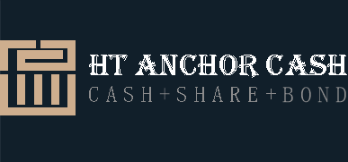

# HTC.CASH-V2 The first Algorithm Stablecoin pegged to HT on Heco Chain

The functions and values of HTCV2 version are confirmed

The new token name of the V2 version:

HTCC =1 to 1 anchored HT algorithm stablecoin

HTCS = shareholder token of the board of directors, holders will be rewarded HTCC dividends when rebase

HTCB=Bond token. When the HTCC price is lower than 1 and higher than 0.9, the square of the HTCC price is used as the conversion ratio for arbitrage.

V2 launch time: January 26, 2021 at 20 o'clock. (SGT)

 

V2's 1 pool: 7 pools, 4201 HTCC will be mined, 1 will be added into liquidity pool, and 1 pool will be ended in 96 hours (after the completion of mining, the mining is completed, the rate of return will be displayed as 0, and the pledge amount keeps normal). The boardroom will be available after 1 pool finished. After another 24 hours, which is 120 hours, the first rebase will be launched. The first round of rebase will be opened at 20 o'clock in the evening on the 31st Jan (SGT)

 

2 destruction pools-permanently locked and destroyed after staking

HTC 1000HTCC-250 HTCC per day-permanent lock-up and destruction, prompting HTC million times deflation.

HTB 1000HTCC - 250 HTCC per day-permanent lock-up and destruction, prompting HTB to consume debt

 

7 non-destructive mining pools 2,200: completed in 4 days

HUSD-400, 100 HTCC per day

USDT-400, 100 HTCC per day

HBTC-400 100 HTCC per day

HETH-400 100 HTCC per day

HT-400 100 HTCC per day

MDX-100, 25 HTCC per day

LHB-100 pcs 25 HTCC daily

 

V2's 2 pools total 5 pools: 2,152,501 HTCS will be mined

HTS Pool-50,000 HTCS, released linearly in one year.

HTCC-HT-LP pool -750,000 HTCS

HTCC-HUSD pool - 750,000 HTCS

HTCS-HT-LP pool - 250,000 HTCS

HTCS-Husd-LP pool - 250,000 HTCS

102,500 tokens will be distributed to DAO and early investors along with mining. No pre-mining: When mining produces 100 htcs, 5 htcs will be output to DAO and early investors.

 

**Economic model upgrade: introduce AMPL's combustion mechanism to achieve two-way rebase, optimize the value of rebase to increase stability.**

**Adjust the board's rebase issuance ratio to make the price return more stable.**

 

When the ratio is higher than 1:1.05, the number of additional tokens issued by the boardroom of each rebase is adjusted to 20% of the part higher than 1.05 (previously 100%), 40% in total per day.

 

40% of the total amount of each rebase will be used to pay debt, and the remaining 60% is still issued through the boardroom. The remaining debts will continuously be repaid during each rebase.

 

Combining AMPL's burning mechanism basically solves the death problem and makes HTCC return to the positive cycle faster.

 

When the 12-hour weighted average price shows that the exchange ratio of HTCC to HT is lower than 0.9, the burning mechanism is activated to burn 5% of tokens Anyone can burn with open interfaces. The conversion ratio after burning should be 0.95+, and it cannot return to more than 1 immediately. It still gives the bond a controllable arbitrage space. It can only be burned once every 12 hours.

 

When burning, the debt balance will not burn.

 

**Optimization of the balance mechanism of total debt and debt arbitrage space**

**Optimization of bond mechanism**

 

When the HTCC weighted 12-hour price is lower than 0.9, the user can only exchange it at the exchange ratio of 0.9 squared: 0.81 to control the total debt.

All HTCC exchanged for bonds is not destroyed, but transferred to the treasury and burned in the same proportion to ensure the uniformity of the global combustion coefficient.

 

**Arbitrage of buying bonds at low prices:**

When the 12-hour weighted price of HTCC is lower than 0.9, it can be converted to HTCB at a ratio of 1:0.81. When the price rises to 1.05, it can be converted back to HTCC at a ratio of 1:1. At this time, the currency standard earns 1.1 times. The price appreciated 1.15 times, and the total U-standard income was 1.265 times.

 

**Exchange HTCC for bond HTCB can avoid burning**

After HTCC is converted into HTCB bonds, the bonds will not be burned. In order to avoid burning deflation, users can choose to exchange bonds at this time for currency-based preservation.

 

Note: In order to realize the burning function, after the boardroom issues additional HTCC, users need to withdraw HTCC to their wallet before the 12-hour weighted average price is lower than 0.9. Otherwise, when it burns, the HTCC rewards not received in the boardroom will be cleared.